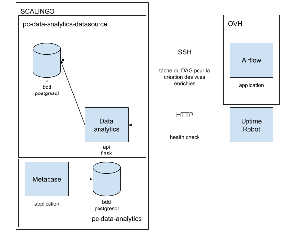

# pass-culture-data-analytics

C'est l'outil d'analyse de données du pass Culture.
Il est composé de :
- un postgresql basé sur celui de la prod et enrichi
- une app flask + une cli
- une app metabase qui rend ces données accessible aux équipes pass Culture



En local, vous avez le choix de faire tourner simplement Flask + Posgresql `make start-backend` ou tout metabase `make start-metabase`

Les commandes utiles au déveleppement se trouvent dans le Makefile ou dans la cli.


## Lancer les commandes relatives à l'environnement Data Analytics
### First setup

1. Cloner le repos
2. Ajouter ses variables d'environnment en local (voir ci-dessous)
3. Installer pipenv
4. `make start-metabase`
5. `make initialize-metabase`
6. Pour créer les tables enrichies la première fois `make create-enriched-views`
7. Pour vérifier `make tests`, tous ces tests devraient être verts (la création des vues enrichies n'est pas instantanée)

### Exemple de variables d'environnement en local :
Créer un fichier .env.local où on peut mettre ces variables d'environnements:

```
export METABASE_USER_NAME='admin@example.com'
export METABASE_PASSWORD='user@AZERTY123'
export METABASE_DBNAME='Produit'
export GREEN_DB_INFO='{
"app_name": "app-green",
"details": {
"port": "5432",
"host": "analytics-datasource-green-postgres",
"dbname": "pass_culture",
"user": "pass_culture",
"password": "passq"
}
}'

export BLUE_DB_INFO='{
"app_name": "app-blue",
"details": {
"port": "5432",
"host": "analytics-datasource-blue-postgres",
"dbname": "pass_culture",
"user": "pass_culture",
"password": "passq"
}
}'
```

## Simuler l'architecture fonctionnelle en local
### Pour démarrer tout Metabase en local
1. `cd pass-culture-data-analytics`
2. `make start-metabase`

### Pour démarrer uniquement les containers du backend
1. `cd pass-culture-data-analytics`
2. `make start-backend`

### Configurer Metabase en une commmande :

Ensuite exécuter les commandes suivantes :
1. `cd pass-culture-data-analytics`
2. Après un  `make start-metabase`
3. lancer `make initialize-metabase`

L'url pour accéder à Metabase en local est : http://localhost:3002/, connectez vous avec METABASE_USER_NAME et METABASE_PASSWORD

### Configurer Metabase manuellement :

Pour configurer Metabase, il suffit de créer un compte admin, puis de se connecter à la base produit. Pour cela, il faut renseigner les informations suivantes :
- Choisir Postgresql comme type de base de données
- Name : Produit
- Host : analytics-datasource-blue-postgres
- Port : 5432
- Database name : pass_culture
- Database username : pass_culture
- Database password : passq


# Aide au développement
## Makefile
La plupart des commandes d'aide au développement (constuire les environnements, lancer les tests) se trouvent dans le Makefile, pour l'utiliser :
1. `cd pass-culture-data-analytics`
2. `make <command>`

### Accéder au résumé des commandes du Makefile
1. `make` ou `make help`

### Lancer la création des tables enrichies
Les tables enrichies sont utilisées pour augmenter les données de prod et permettre plus de traitements aux data-analystes.

On peut les créer via :
- le makefile :ou `make create-enriched-views`
- il est aussi possible de passer par le flask :
`curl -X POST $DATA_ANALYTICS_DATASOURCE_URL?token=$DATA_ANALYTICS_TOKEN`
Où `$DATA_ANALYTICS_DATASOURCE_URL` correspond à l'url de Metabase et `$DATA_ANALYTICS_TOKEN` au token d'authentification autorisant la création des tables enrichies

2. Il faut ensuite synchroniser la base sur metabase
- se rendre sur http://localhost:3002/admin/databases
- choisir la base à synchroniser (Produit)
- cliquer sur `Sync database schema now`
- vos tables enrichies sont maintenant accessibles


### Exécution des tests
Après avoir lancé les contenuers du backend, taper :
`make tests`
Certains tests échoueront tant que les vues enrichies n'ont pas été créées (cela peut prendre quelques secondes)

### Accéder à la base locale
1. `make access-database`

### Exécution de code python dans le container
1. `make run-python`

### Reset metabase
Supprime le volume lié au postgresql de metabase et reconstruit les environnements metabase (sans détruire les autres)
1. `make reset-metabase`


## la CLI pc-data-analytics
### Accéder à cli sans avoir besoin de créer un nouvel environnement
Pour cela, on peut se connecter directement sur container docker dans lequel tourne Flask :
1. `docker exec -it analytics-datasource-application bash`
2. `cd /opt/data-analytics`
3. `pipenv shell`
4. rentrer votre commande : `pc-data-analytics`

### Installer le package, utiliser la cli dans un autre environnement
1. Créer le package à partir du code de pass-culture-data-analytics
`cd pass-culture-data-analytics`
`make dist`
2. L'installer dans un environnement virtuel

a) Activer l'environnement cible

Par exemple :
Monter un virtualenv ([lien](https://python-guide-pt-br.readthedocs.io/fr/latest/dev/virtualenvs.html)) afin d'avoir un environnement isolé et contextualisé : `pip install virtualenv`
- exécuter les commandes suivantes :
0. ajouter vos variables d'environnement
1. `cd <path_to_my_env_folder>`
2. `virtualenv venv -p python3` (si vous n'avez pas python3).
3. Sinon faire `python3 -m venv venv`
4. `source venv/bin/activate`

b) Dans cet environnement :
`pip install -e <path_to_pass-culture-data-analytics>`


### Accéder au résumé des commandes de la Cli
Vous pouvez faire un `pc-data-analytics` pour voir la liste des commandes à lancer

### Requêter l'environnement connecté à la base Produit sur Metabase
Une fois le paquet installé, taper :
`pc-data-analytics show_app_name_for_restore`

### Basculer de la base blue à green (et vice-versa)
Une fois le paquet installé, taper :
`pc-data-analytics switch_host_for_restore`


# Utiliser python dans le postgres :

on va installer une extension sur postgres : plpython3u
1- se connecter au container
`docker exec -it analytics-datasource-blue-postgres bash`
2- mettre à jour les packets et installer le packet contenant l'extension
`apt-get update && apt-get install postgresql-plpython3-11`
3- installer l'extension sur postgres
`psql -U pass_culture`
`CREATE EXTENSION plpython3u;`

